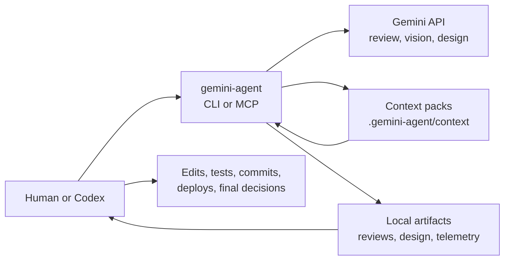
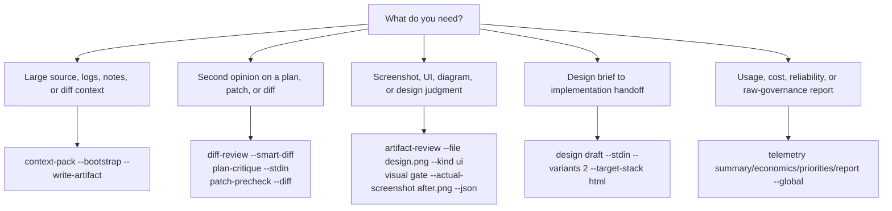

# gemini-agent

[](LICENSE)


Local-first Gemini tools for Codex and other agentic coding workflows.

`gemini-agent` lets a coding agent ask Gemini for the parts where a second
model is useful: compacting large context, reviewing diffs, critiquing plans,
checking screenshots and UI artifacts, drafting design handoff artifacts, and
analyzing opt-in telemetry. Codex, or the human operator, remains the execution
authority for editing files, running tests, committing, deploying, and making
final release decisions.

The project is public and MIT licensed, but the npm package is intentionally
marked `"private": true` to avoid accidental registry publishing. Use it from a
checked-out repository or a local npm link.

## Why Use It?

| When you need to... | Run this first | What comes back |
| --- | --- | --- |
| Keep Codex from rereading a large repo slice | `context-pack --bootstrap --write-artifact` | A reusable `.gemini-agent/context/latest.json` summary |
| Get a second opinion before committing | `diff-review --smart-diff` | Structured risks, missing tests, unsafe claims, and suggested changes |
| Check whether a UI screenshot looks shippable | `visual gate --actual-screenshot after.png --kind ui --json` | A pass, caution, or block result with safe visual notes |
| Turn a design brief into implementation guidance | `design draft --stdin --target-stack html` | A design run with candidates, prototype, and Codex handoff artifacts |
| Understand opt-in usage and reliability | `telemetry report --global --json` | Aggregate health, economics, latency, context reuse, and quality signals |



## What It Is Not

`gemini-agent` is not another autonomous coding agent. It is a local
coprocessor that gives Codex or another operator compact context, review
judgment, multimodal inspection, and design handoff artifacts.

| Adjacent product | Best known for | How `gemini-agent` is different |
| --- | --- | --- |
| [OpenAI Codex CLI](https://github.com/openai/codex) | A local terminal coding agent that can read, edit, and run code | `gemini-agent` does not edit source; it reviews, summarizes, and produces local artifacts for Codex |
| [Gemini CLI](https://github.com/google-gemini/gemini-cli) | Direct Gemini access from the terminal with built-in tools and MCP support | `gemini-agent` narrows Gemini usage to review gates, context packs, visual checks, and design workflows |
| [Aider](https://github.com/Aider-AI/aider) | AI pair programming inside a git repository | `gemini-agent` is a second-opinion and artifact pipeline, not a pair-programming editor |
| [Repomix](https://github.com/yamadashy/repomix) | Packing repositories into AI-friendly files | `gemini-agent` creates reusable Gemini-generated context packs and feeds them into review gates |
| [CodeRabbit](https://docs.coderabbit.ai/cli) and [Greptile](https://www.greptile.com/docs/introduction) | Context-aware code review for local changes or pull requests | `gemini-agent` is local-first, manual or MCP-triggered, and keeps final execution authority with Codex or the user |

## Requirements

- Node.js 22 or newer.
- A Gemini API key available as `GEMINI_API_KEY`, `GOOGLE_API_KEY`, or, on
  macOS, stored by `gemini-agent auth set` in Keychain service
  `GEMINI_API_KEY`.
- Optional image model environment variables for design/image routes:
  `GEMINI_IMAGE_MODEL` for fast image generation and `GEMINI_IMAGE_PRO_MODEL`
  for pro-quality design generation.

Runtime text and review calls default to `gemini-3.5-flash`. Image and design
generation use the explicit image model variables above.

## Install

```bash
git clone https://github.com/yha9806/gemini-agent.git
cd gemini-agent
npm install
./bin/gemini-agent --help
./bin/gemini-agent --help-all
```

Default help is intentionally short: it shows the setup commands and the
workflow entrypoints most users need first. Use `--help-all` when you want the
complete operator surface, including advanced design steps and telemetry
governance commands.

Use the local binary directly:

```bash
./bin/gemini-agent auth status
```

Or link it into your shell while developing:

```bash
npm link
gemini-agent auth status
```

## Configure Credentials

Use an environment variable in any shell:

```bash
export GEMINI_API_KEY="..."
./bin/gemini-agent auth status
```

On macOS, store the key in Keychain instead:

```bash
./bin/gemini-agent auth set
./bin/gemini-agent auth status
```

`auth status` reports only whether a key is available and where it came from.
It never prints the key.

## First Run

```bash
./bin/gemini-agent ask "Reply with exactly: gemini-agent-ok"
```

Expected output:

```text
gemini-agent-ok
```

If the command says the key is missing, set `GEMINI_API_KEY` or run
`./bin/gemini-agent auth set`.

## Common Workflows



### Review The Current Diff

Use this before committing risky or release-bound changes:

```bash
./bin/gemini-agent diff-review --smart-diff
```

`--smart-diff` reviews the current git diff with a reusable project context
pack. If `.gemini-agent/context/latest.json` is missing, it first bootstraps one
with:

```bash
./bin/gemini-agent context-pack --bootstrap --write-artifact
```

When you already have a relevant context pack, this explicit form is equivalent:

```bash
./bin/gemini-agent diff-review --auto-context-pack --diff
```

Other review gates use the same input model:

```bash
./bin/gemini-agent plan-critique --stdin
./bin/gemini-agent patch-precheck --diff
./bin/gemini-agent research-brief --file notes.md
```

Gate commands accept `--file`, `--stdin`, `--diff`, direct text, `--context-pack
<path>`, and `--auto-context-pack`. Oversized raw inputs print retry guidance so
you can create or reuse a context pack instead of raising byte limits blindly.

### Compress Project Context

```bash
./bin/gemini-agent context-pack --bootstrap --write-artifact
./bin/gemini-agent context-pack --doctor --json
```

Context packs are compact structured summaries for Codex. They are written
under `.gemini-agent/context/`, which is ignored by git.

### Review Screenshots And Artifacts

```bash
./bin/gemini-agent artifact-review --file design.png --kind ui
./bin/gemini-agent artifact-review --file design.png --kind ui --review-depth quick
./bin/gemini-agent artifact-review --file before.png --file after.png --kind ui --review-mode comparison
```

For implementation checks, use the visual gate:

```bash
./bin/gemini-agent visual gate --actual-screenshot after.png --kind ui --smoke-only --json
./bin/gemini-agent visual gate --target-screenshot target.png --actual-screenshot after.png --kind ui --risk design-implementation --json
```

`visual gate` combines local screenshot smoke checks with optional Gemini review
and returns a pass, caution, or block-style result. Visual gate outputs and
telemetry do not expose raw prompts, raw responses, local paths, media file
names, or image bytes in ordinary outputs.

### Draft Design Work

Design commands write reviewable artifacts under `.gemini-agent/design/<run-id>/`.
They do not edit your source tree.

```bash
./bin/gemini-agent design brief --stdin --write-artifact
./bin/gemini-agent design draft --stdin --variants 2 --quality fast --target-stack html
./bin/gemini-agent design generate --run .gemini-agent/design/<run-id> --variants 2 --quality fast
./bin/gemini-agent design perceive --run .gemini-agent/design/<run-id> --file screenshot.png --target "hero: main area"
./bin/gemini-agent design prototype --run .gemini-agent/design/<run-id> --target-stack html
./bin/gemini-agent design handoff --run .gemini-agent/design/<run-id>
./bin/gemini-agent design loop --run .gemini-agent/design/<run-id> --target-screenshot target.png --actual-screenshot after.png
./bin/gemini-agent design doctor --json
```

The design loop keeps Codex as the source-editing authority. Gemini provides
briefs, candidates, perception notes, prototype drafts, handoff artifacts, and
target-vs-actual feedback.

### Use With Codex

To install the active global Codex policy block, dry-run first:

```bash
./bin/gemini-agent install-codex-global --mode active --dry-run
./bin/gemini-agent install-codex-global --mode active --write
```

The installer updates `~/.codex/AGENTS.md`, writes a backup before changes, and
defaults to dry-run behavior unless `--write` is present.

### Use As An MCP Server

`gemini-agent-mcp` is a stdio MCP server entrypoint for Codex and other MCP
clients. It is not a standalone shell command.

Example MCP command path:

```json
{
  "mcpServers": {
    "gemini-agent": {
      "command": "/absolute/path/to/gemini-agent/bin/gemini-agent-mcp"
    }
  }
}
```

The MCP server exposes review tools, context packing, artifact review, design
drafting, and resources for the latest local artifacts:

- `gemini_auth_status`
- `gemini_plan_critique`, `gemini_patch_precheck`, `gemini_diff_review`,
  `gemini_research_brief`
- `gemini_context_pack`
- `gemini_artifact_review`
- `gemini_design_draft`
- `gemini-agent://context/latest`
- `gemini-agent://reviews/latest`
- `gemini-agent://artifact-reviews/latest`
- `gemini-agent://design/latest`
- `gemini-agent://policy/current`

## Telemetry

Telemetry is opt-in. Raw telemetry mode can capture prompts and responses, so it
requires `--confirm-raw-content` and should be enabled only when your project
data policy permits it.

Basic status and reports:

```bash
./bin/gemini-agent telemetry status --global
./bin/gemini-agent telemetry summary --global
./bin/gemini-agent telemetry summary --global --json
./bin/gemini-agent telemetry economics --global
./bin/gemini-agent telemetry priorities --global
./bin/gemini-agent telemetry report --global --json
```

Raw telemetry governance commands are explicit and bounded:

```bash
./bin/gemini-agent telemetry raw inventory --global
./bin/gemini-agent telemetry raw inventory --global --json
./bin/gemini-agent telemetry raw preflight --global --batch-size 1 --json
./bin/gemini-agent telemetry raw export --global --state pending --output ./raw-export.jsonl --limit 100 --confirm-raw-content --json
./bin/gemini-agent telemetry raw reveal --global --state sent --limit 1 --confirm-raw-content --json
./bin/gemini-agent telemetry raw delete --global --state sent --event-id evt_example --confirm-raw-content --dry-run --json
./bin/gemini-agent telemetry raw prune --global --state sent --keep-days 30 --dry-run
./bin/gemini-agent telemetry raw prune --global --state sent --keep-days 30 --write --json
```

Scheduler and delivery validation examples:

```bash
./bin/gemini-agent telemetry enable --global --level raw --endpoint http://127.0.0.1:8787/ingest --token-env GEMINI_AGENT_TELEMETRY_TOKEN --deployment-id gemini-agent-main --user-label local-admin --confirm-raw-content
./bin/gemini-agent telemetry validate --global --endpoint http://127.0.0.1:8787/ingest --token-env GEMINI_AGENT_TELEMETRY_TOKEN --deployment-id gemini-agent-main --confirm-raw-content
./bin/gemini-agent telemetry flush --global
./bin/gemini-agent telemetry tick --global --batch-size 1 --timeout-ms 20000
./bin/gemini-agent telemetry install-scheduler --global --target launchd --name gemini-agent-main --schedule daily@09:00 --batch-size 1 --timeout-ms 20000 --env-file ~/.gemini-agent/telemetry.env --dry-run
./bin/gemini-agent telemetry scheduler-status --target launchd --name gemini-agent-main
./bin/gemini-agent telemetry uninstall-scheduler --target launchd --name gemini-agent-main
```

Local receiver:

```bash
./bin/gemini-agent-telemetry-receiver --host 127.0.0.1 --port 8787 --storage ./.telemetry-data --token-env GEMINI_AGENT_TELEMETRY_TOKEN
```

Loopback HTTP endpoints are allowed for local validation. Non-loopback telemetry
endpoints require HTTPS.

## Safety Model

- Gemini gives advice, summaries, structured reviews, and design artifacts.
  Codex or the operator remains responsible for edits, tests, commits, and final
  decisions.
- Credentials are read from `GEMINI_API_KEY`, `GOOGLE_API_KEY`, or macOS
  Keychain. `auth status` never prints secret values.
- Project policy is discovered from `.gemini-agent-policy.json` when present.
- Generated context, review, design, and telemetry working artifacts live under
  `.gemini-agent/`, which is ignored by git.
- Raw telemetry stores prompts and responses after best-effort
  credential-pattern masking. Masking is not a complete PII or secret removal
  guarantee.
- Telemetry summary, economics, priorities, and report commands aggregate usage,
  latency, context reuse, visual gate outcomes, multimodal coverage, and
  structured-response diagnostics without printing raw prompts, raw responses,
  local paths, event ids, batch ids, media file names, or image bytes in ordinary
  output.
- Fake responses require `GEMINI_AGENT_ALLOW_FAKE_RESPONSE=1`.

## Development

```bash
npm install
npm test
```

Optional live smoke test:

```bash
GEMINI_AGENT_RUN_LIVE_TESTS=1 npm run test:live
```

The live test calls Gemini and requires credentials. Normal `npm test` uses
Node's built-in test runner, keeps live Gemini smoke tests skipped, and should
not require a Gemini API key.

Before contributing, run the focused command you changed plus `npm test`. Keep
`.gemini-agent/`, `node_modules/`, generated screenshots, raw exports, and local
telemetry stores out of commits unless a test fixture explicitly requires them.

See [CONTRIBUTING.md](CONTRIBUTING.md) for pull request expectations and
[SECURITY.md](SECURITY.md) for vulnerability reporting and data-handling
guidance.

## License

MIT. See [LICENSE](LICENSE).
