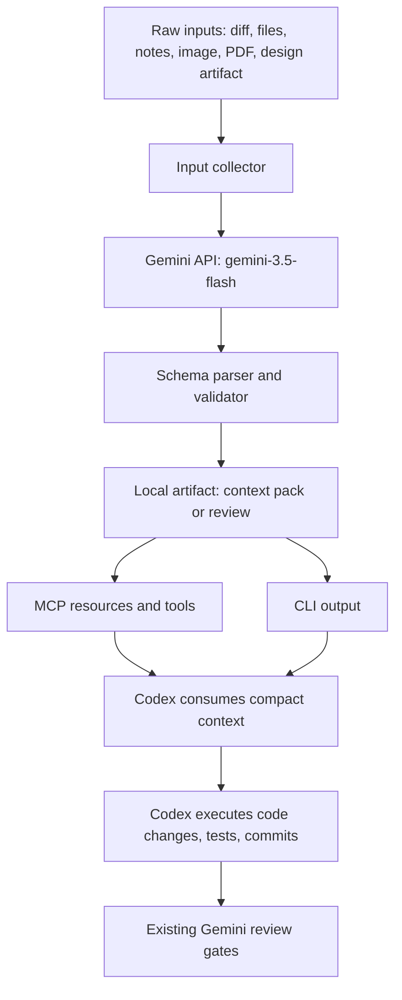

# Gemini Context Coprocessor Design

Date: 2026-05-28

## Summary

`gemini-agent` should evolve from a narrow second-opinion review gate into a Gemini-powered context and design coprocessor for Codex.

The product goal is not to replace Codex, Claude Code, Cursor, or Superpowers. The goal is to reduce Codex token consumption and expand Codex's perception by using Gemini API calls for large-context, multimodal, research, and design analysis. Codex remains the execution authority for file edits, commands, tests, commits, and Superpowers workflows.

The next version should add two user-facing workflows:

- `context-pack`: compress code, diffs, notes, and selected project files into a structured context pack that Codex can consume cheaply.
- `artifact-review`: analyze images, PDFs, design screenshots, diagrams, paper figures, or other visual/document artifacts and return a structured design or research brief.

Existing review gates remain:

- `plan-critique`
- `patch-precheck`
- `diff-review`
- `research-brief`

The first implementation should be deliberately small: text/code context packing and image/PDF artifact review. Video, explicit Gemini context caching, batch jobs, repository indexing, and automatic routing should come later after the schema and evaluation loop are stable.

## Design Principles

1. Codex executes, Gemini compresses and critiques.

   `gemini-agent` must not edit files, run arbitrary project commands, create commits, or become the source of truth for test results. It can advise and produce structured artifacts.

2. Reduce Codex tokens by moving raw context out of the Codex prompt.

   Large raw materials should be summarized once by Gemini into compact JSON or Markdown artifacts. Codex should read those summaries instead of repeatedly ingesting the raw source files, PDFs, images, or design screenshots.

3. Preserve traceability.

   Every generated context pack or artifact review should record source paths, timestamps, model ID, input mode, and a short limitation statement. Codex needs to know what Gemini saw and what it did not see.

4. Prefer structured output.

   Gemini responses should use JSON schema where practical. Free-form Markdown is acceptable only for human-facing reports derived from a structured object.

5. Keep the runtime model fixed.

   Runtime Gemini calls remain on `gemini-3.5-flash`. There is no model router in this design. This matches the current project decision that all calls should use the Gemini 3.5 Flash runtime model.

6. No automatic router in v1.

   Routing decisions are policy-sensitive. The first version should expose explicit commands and MCP tools. Automatic "send this to Gemini" behavior can be designed after usage data and evals exist.

## Architecture



The new architecture adds three internal modules while preserving the existing CLI and MCP shape:

- `input-collector`: reads text, file paths, directories, and artifact metadata, then creates Gemini content parts.
- `context-pack`: builds prompts and schemas for compact project summaries.
- `artifact-review`: builds prompts and schemas for multimodal design, visual, and document review.

The existing modules continue to own their current responsibilities:

- `gemini-client.mjs`: Gemini SDK calls, model constant, structured output requests, API error redaction.
- `schemas.mjs`: Zod validation and pretty JSON rendering.
- `prompts.mjs`: prompt construction.
- `policies.mjs`: `.gemini-agent-policy.json` discovery and rendering.
- `cli.mjs`: command routing and stdin/file handling.
- `mcp-server.mjs`: MCP tool registration.
- `keychain.mjs`: credential resolution.

## Commands

### `context-pack`

Purpose: produce a compact context summary for Codex.

Example CLI:

```bash
gemini-agent context-pack --file README.md --file src/cli.mjs --stdin
gemini-agent context-pack --diff --output .gemini-agent/context/latest.json
```

Input types:

- stdin text
- explicit file paths
- current git diff
- short user notes

The first version should not recursively index the repository. Directory and glob expansion can be added later with size limits.

Output shape:

```json
{
  "kind": "context_pack",
  "source_summary": ["string"],
  "project_facts": ["string"],
  "relevant_files": [
    {
      "path": "string",
      "why_relevant": "string"
    }
  ],
  "open_questions": ["string"],
  "risks": ["string"],
  "recommended_codex_actions": ["string"],
  "limitations": ["string"],
  "metadata": {
    "model": "gemini-3.5-flash",
    "generated_at": "ISO-8601 string",
    "sources": ["string"]
  }
}
```

### `artifact-review`

Purpose: analyze multimodal artifacts before Codex consumes them.

Example CLI:

```bash
gemini-agent artifact-review --file design.png --kind ui
gemini-agent artifact-review --file paper.pdf --kind research
gemini-agent artifact-review --file diagram.jpg --kind architecture
```

Initial supported file types:

- PNG
- JPEG
- WEBP
- PDF

Video support should be deferred because it introduces higher latency, timestamp handling, file processing state, and stronger cost controls.

Output shape:

```json
{
  "kind": "artifact_review",
  "artifact_type": "image | pdf | design | diagram | research",
  "summary": ["string"],
  "important_details": ["string"],
  "design_or_research_findings": ["string"],
  "implementation_hints_for_codex": ["string"],
  "risks_or_ambiguities": ["string"],
  "questions_for_user": ["string"],
  "limitations": ["string"],
  "metadata": {
    "model": "gemini-3.5-flash",
    "generated_at": "ISO-8601 string",
    "sources": ["string"]
  }
}
```

### Existing gates

Existing review gates should remain compatible. `diff-review`, `plan-critique`, `patch-precheck`, and `research-brief` can later accept `--context-pack <path>` so Gemini can critique with prior compact context without requiring Codex to paste everything again.

## MCP Design

The MCP server should expose both tools and resources.

Tools:

- `gemini_context_pack`
- `gemini_artifact_review`
- existing `gemini_plan_critique`
- existing `gemini_patch_precheck`
- existing `gemini_diff_review`
- existing `gemini_research_brief`
- existing `gemini_auth_status`

Resources:

- `gemini-agent://context/latest`
- `gemini-agent://artifact-reviews/latest`
- `gemini-agent://reviews/latest`
- `gemini-agent://policy/current`

Resources should read local generated artifacts from `.gemini-agent/`. They should not trigger network calls by themselves. This keeps MCP resource reads cheap and predictable.

## Storage

Generated artifacts should live under `.gemini-agent/` in the current project:

```text
.gemini-agent/
  context/
    latest.json
    2026-05-28T120000Z-context-pack.json
  artifacts/
    latest.json
    2026-05-28T120000Z-artifact-review.json
  reviews/
    latest.json
```

The project should not automatically commit `.gemini-agent/` outputs. These files are working artifacts, not source by default. A later policy option can allow selected outputs to be committed when useful.

The implementation should add `.gemini-agent/` to the repository `.gitignore` as part of the first feature commit. If a future command is run in a project without a writable `.gitignore`, it should warn that generated artifacts may be visible to version control.

Writes to `latest.json` must be atomic. The writer should write a timestamped file first, then write a temporary `latest.json.tmp-<pid>-<nonce>` file and rename it to `latest.json`. This avoids partially written `latest.json` files when CLI and MCP calls overlap.

Concurrent writes use "last completed writer wins" semantics for `latest.json`. The timestamped artifacts remain available even when two commands complete close together, so no generated review is lost. A file-locking queue can be added later if deterministic latest ordering becomes important.

## Cost And Token Strategy

There are two separate cost targets:

1. Reduce Codex token use.

   The main saving comes from Codex reading compact Gemini outputs instead of raw PDFs, screenshots, long notes, or many source files.

2. Control Gemini API cost.

   The first version should use size limits and explicit commands. Later versions can add Gemini explicit context caching for repeated large inputs and Batch API for non-urgent bulk analysis.

The first version should implement:

- input byte limits with clear errors
- source list metadata
- output artifact reuse through MCP resources
- manual command invocation
- truncation and omission metadata when an input exceeds the configured limit

Later versions can implement:

- explicit Gemini context caching
- batch mode for nightly audits and evals
- local content fingerprints to skip unchanged artifact analysis
- repository-level summaries

## Error Handling

The new workflows should follow current safety patterns:

- Missing API key returns a clear credential error.
- Empty input is rejected before credential lookup.
- Unsupported file type returns a clear validation error.
- Oversized input returns a clear size-limit error before upload.
- Gemini SDK errors redact API keys and local secrets.
- Schema parse failures identify the workflow and expected output type.
- Artifact paths are recorded in metadata, but file contents are not echoed back in errors.

For multimodal files, failures should distinguish:

- file not found
- unsupported MIME type
- upload or file-processing failure
- Gemini generation failure
- schema validation failure

## File Handling

The first implementation should use strict file handling rather than broad magic detection.

MIME strategy:

- Use a strict extension-to-MIME allowlist for v1.
- Accept `.png`, `.jpg`, `.jpeg`, `.webp`, and `.pdf`.
- Match extensions case-insensitively.
- Reject files with no extension or unsupported extensions.
- Do not trust user-supplied MIME values.

Size strategy:

- Text inputs are capped separately from binary artifacts. The default total text cap is 4 MB per request.
- Inline image input is allowed up to 20 MB per file.
- PDFs and files larger than 20 MB should use Gemini Files API instead of inline content.
- v1 should cap total local binary artifact bytes per request to a project-configurable limit, with a default of 50 MB.
- If a file is omitted or truncated because of size, the output metadata must include that fact.

Files API uploads must be cleaned up when the SDK supports deletion. The implementation should use a `try`/`finally` cleanup path so uploaded temporary files are deleted after generation succeeds or fails. If deletion is unavailable in the installed SDK, the output metadata and stderr warning should record that remote cleanup could not be confirmed.

The implementation plan should verify current `@google/genai` JavaScript SDK support for Files API upload, polling, and deletion before coding PDF upload behavior. If Files API support is not available in the installed SDK version, v1 should support image inline input first and keep PDF support behind a clear "unsupported by current runtime" error rather than silently failing.

## Testing Strategy

The first implementation plan should use TDD and cover:

- `context-pack` rejects empty input before API key lookup.
- `context-pack` sends the expected prompt and schema through a fake Gemini client.
- `context-pack` writes a valid `.gemini-agent/context/latest.json` artifact when requested.
- local artifact writes are atomic and leave a valid `latest.json`.
- concurrent artifact writes keep valid timestamped artifacts and a valid `latest.json`.
- `.gemini-agent/` is added to `.gitignore` during the implementation.
- `artifact-review` rejects unsupported file types before API key lookup.
- `artifact-review` rejects extension edge cases such as no extension, uppercase unsupported extensions, and mismatched allowlist values.
- `artifact-review` constructs multimodal content parts for image and PDF inputs.
- oversized image/PDF inputs either use the Files API path or return the designed size-limit error.
- text inputs over the configured text cap fail before Gemini API calls.
- Files API uploads are deleted after success and after generation failure when deletion is supported.
- `artifact-review` validates structured output and records source metadata.
- MCP exposes new tools and resources.
- MCP resources read existing local artifacts without making Gemini API calls.
- Existing review gates still pass.

Integration tests using live Gemini should remain opt-in, similar to the current `test:live` script.

## Non-Goals For V1

- No file editing by Gemini.
- No automatic background review.
- No repository-wide indexing.
- No automatic router.
- No branch management.
- No terminal command execution.
- No video support.
- No batch jobs.
- No explicit Gemini context cache management.
- No claim that compressed context is lossless.

## Rollout Plan

1. Add schemas and prompt builders for `context_pack` and `artifact_review`.
2. Add input collector support for stdin, file paths, MIME detection, and safe size checks.
3. Add Gemini client support for multimodal content parts while keeping model fixed to `gemini-3.5-flash`.
4. Add CLI commands.
5. Add local artifact writing under `.gemini-agent/`.
6. Add MCP tools.
7. Add MCP resources for latest local artifacts.
8. Add opt-in live smoke tests.
9. Collect example outputs and use them to build a small eval set.

## Open Design Decisions

These are intentionally resolved for v1:

- The first version supports explicit inputs only, not automatic repo indexing.
- Generated artifacts are local working files and are not committed by default.
- Runtime model remains fixed to `gemini-3.5-flash`.
- Codex and Superpowers remain the execution authority.
- The first multimodal scope is image and PDF, not video.

## References

- Gemini structured output: https://ai.google.dev/gemini-api/docs/structured-output
- Gemini image understanding: https://ai.google.dev/gemini-api/docs/image-understanding
- Gemini video understanding: https://ai.google.dev/gemini-api/docs/video-understanding
- Gemini document understanding: https://ai.google.dev/gemini-api/docs/document-processing
- Gemini context caching: https://ai.google.dev/gemini-api/docs/caching
- Gemini Batch API: https://ai.google.dev/gemini-api/docs/batch-mode
