# Gemini Agent Productization Design

Date: 2026-05-31

## Summary

`gemini-agent` should become a deployable product feedback and coprocessor loop for Codex work.

The product goal is to reduce Codex token consumption and increase Codex's perception by using Gemini API calls for large-context compression, multimodal artifact review, design critique, and structured second opinions. Code review is one workflow, not the whole product. The system also needs to collect deployed-user telemetry, including raw prompt and response payloads when raw telemetry is explicitly enabled, and deliver that data to a local or vulcaart.art endpoint on a schedule.

The selected implementation shape is **B. Integrated Product Slice**:

- `gemini-agent`: client capture, local queue, telemetry sender, scheduler installer, active Codex global setup, and release checks.
- `vulca-platform/wenxin-backend`: FastAPI ingest endpoint, storage, metrics, governance API, retention, and admin actions.
- `vulca-platform/wenxin-moyun`: operator dashboard for delivery health, samples, governance, and release validation.
- `vulca`: unchanged in v1 unless a shared SDK/client helper becomes necessary after the product slice is working.

All runtime Gemini calls stay on `gemini-3.5-flash`.

Because model IDs can change at the provider boundary, release validation must include a live model-ID smoke test for this exact configured model. If Google rejects `gemini-3.5-flash`, the release is blocked and the model decision returns to the user instead of silently falling back to another model.

## Product Principles

1. Codex executes, Gemini compresses and critiques.

   `gemini-agent` can advise, summarize, critique, and produce structured artifacts. It must not edit files, run arbitrary project commands, create commits, or become the source of truth for tests.

2. Superpowers controls process gates.

   User instructions have highest priority. Superpowers process skills remain authoritative for brainstorming, TDD, debugging, verification, review, and release workflows. `gemini-agent` participates inside those workflows; it does not bypass them.

3. Raw telemetry is powerful but sensitive.

   Raw prompt/response collection is allowed because it is necessary for product improvement, but only behind explicit raw mode, separate deployment tokens, HTTPS for non-loopback endpoints, size limits, retention, export/delete controls, and audit logs.

4. Build the first production path before widening analytics.

   v1 should prove one complete path from client capture to vulcaart.art storage to operator dashboard. Advanced analytics, automated product recommendations, training pipelines, and public multi-tenant analytics should come later.

## Scope

This design covers five productization tracks:

- Public or intranet ingest endpoint on the vulcaart.art backend.
- Scheduler/installer so telemetry can send without manual `flush`.
- Data governance for raw prompt/response telemetry.
- Operator dashboard in `wenxin-moyun`.
- Release and validation pipeline across the touched repos.

The first slice is an internal operator product. It is not a public customer-facing analytics portal.

## Architecture

```mermaid
flowchart LR
  UserTask["Codex task using gemini-agent"] --> Capture["gemini-agent raw capture"]
  Capture --> Queue["Local telemetry queue"]
  Queue --> Tick["Scheduled telemetry tick"]
  Tick --> Ingest["vulcaart.art FastAPI ingest"]
  Ingest --> Store["Postgres/SQLAlchemy storage"]
  Store --> Dashboard["wenxin-moyun admin dashboard"]
  Dashboard --> Governance["Export, reveal, retention, pause, delete"]
  Governance --> Improve["Product improvement loop"]
```



### Repository Boundaries

`gemini-agent` owns:

- Gemini API calls through the existing CLI and MCP tools.
- Raw prompt/response capture for Gemini calls.
- Local queue durability and retry behavior.
- `telemetry validate`, `flush`, and `tick`.
- New scheduler install/status/uninstall commands.
- New global Codex setup command for active Gemini Agent invocation.
- Client-side contract fixtures and release checks.

`vulca-platform/wenxin-backend` owns:

- `POST /api/v1/gemini-agent/telemetry/ingest`.
- Deployment token authentication for ingest.
- Admin-authenticated operator APIs.
- SQLAlchemy models, Alembic migrations, retention jobs, audit logs, and metrics.
- Rate limiting and payload size enforcement.

`vulca-platform/wenxin-moyun` owns:

- Guarded admin route `/admin/gemini-agent`.
- API client functions using existing `API_PREFIX`.
- Operational dashboard views and governance actions.
- Frontend tests and route smoke checks.

`vulca` remains out of the first slice.

## Data Flow

1. A Codex task or MCP client invokes a `gemini-agent` command or tool.
2. The Gemini call captures event metadata plus raw prompt/response payloads when raw telemetry is enabled.
3. The event is appended to the local queue under `.gemini-agent/telemetry`.
4. A scheduler runs `gemini-agent telemetry tick`.
5. `tick` checks the configured schedule and flushes only when due.
6. The sender posts a strict batch to `https://vulcaart.art/api/v1/gemini-agent/telemetry/ingest`.
7. The backend validates token, schema, payload size, and rate limits.
8. Accepted event metadata and raw payload rows are stored with retention metadata.
9. The admin dashboard reads metrics, samples, and governance state.
10. Operators export, reveal, delete, pause, rotate, or purge through audited admin actions.

If a machine is off or asleep, no sending happens. The next actual scheduler run invokes `tick`, which decides whether the configured schedule is due. The system must not promise universal catch-up behavior because cron, launchd, and systemd differ.

## Backend API

All endpoints live under:

```text
/api/v1/gemini-agent/telemetry
```

### Ingest

```text
POST /ingest
Authorization: Bearer <deployment-token>
```

The deployment token is separate from `GEMINI_API_KEY`. The backend stores only a hash of the token.

The response acknowledges accepted event IDs and rejected items. The client retries only retryable failures and never treats a non-ACK as delivered.

### Operator Reads

Operator endpoints use the existing admin authentication path in `wenxin-backend`, not deployment tokens.

```text
GET /health
GET /metrics
GET /deployments
GET /deployments/{deployment_id}/events
GET /events/{event_id}
GET /audit-log
```

List views return redacted previews. Full raw prompt/response detail requires an explicit reveal action.

### Governance Actions

```text
POST /deployments/{deployment_id}/export
PATCH /deployments/{deployment_id}/retention
POST /deployments/{deployment_id}/pause
POST /deployments/{deployment_id}/rotate-token
POST /deployments/{deployment_id}/purge-expired
DELETE /deployments/{deployment_id}/raw-payloads
DELETE /deployments/{deployment_id}
```

Every export, raw reveal, retention change, pause, token rotation, purge, and deletion writes an append-only audit row.

## Payload Contract

Batch shape:

```json
{
  "schema_version": "raw-v1",
  "batch_id": "string",
  "deployment_id": "string",
  "agent_version": "string",
  "generated_at": "ISO-8601 string",
  "checksum": "string",
  "events": []
}
```

Event shape:

```json
{
  "event_id": "string",
  "source_host_app": "codex|cli|mcp|other",
  "trigger_source": "manual|scheduled|mcp|global_policy",
  "model_provider": "google",
  "model": "gemini-3.5-flash",
  "command": "ask|context-pack|artifact-review|plan-critique|patch-precheck|diff-review|research-brief",
  "started_at": "ISO-8601 string",
  "ended_at": "ISO-8601 string",
  "latency_ms": 0,
  "status": "success|error",
  "usage": {
    "input_tokens": 0,
    "output_tokens": 0,
    "total_tokens": 0
  },
  "request_raw": {},
  "prompt_raw": "string",
  "response_raw": "string",
  "response_candidates_raw": [],
  "tool_calls_raw": [],
  "media_manifest": [],
  "error": null,
  "metadata": {}
}
```

`media_manifest` records metadata only in v1: MIME type, size, content hash, dimensions when available, and safe labels. Binary media upload is off by default. Inline base64 or large JSON still counts against payload limits and can be rejected.

The client and server both reject unknown major schema versions.

## Storage Model

Backend tables:

- `gemini_agent_telemetry_deployments`
  - deployment ID, label, status, token hash, raw enabled flag, retention days, created time, updated time, last seen time.
- `gemini_agent_telemetry_batches`
  - batch ID, deployment ID, schema version, checksum, event count, byte size, accepted/rejected counts, received time.
- `gemini_agent_telemetry_events`
  - event ID, deployment ID, batch ID, model, command, source, timings, status, usage, prompt/response lengths, searchable metadata.
- `gemini_agent_telemetry_raw_payloads`
  - event ID, request JSON, prompt text, response text, candidates JSON, tool calls JSON, media manifest JSON, sensitivity flags, `expires_at`.
- `gemini_agent_telemetry_audit_log`
  - operator, action, target type, target ID, timestamp, reason, before/after metadata where safe.

Raw payload rows should be date-partitioned when production volume requires it. v1 may start without partitions if the migration keeps the retention path explicit and tested.

Default retention:

- Raw payloads: 30 days.
- Metadata: 180 days.

Retention purge is not a FastAPI in-process background promise. It runs through a secured admin endpoint called by deployment scheduler or cron, with a manual dashboard trigger as a fallback.

## Safety And Reliability

Client-side rules:

- Raw mode requires explicit `--confirm-raw-content`.
- Non-loopback telemetry endpoints require HTTPS.
- Telemetry token env must not be `GEMINI_API_KEY`.
- Prompt, response, request, and tool-call payloads pass through the existing best-effort credential-pattern masking before queuing. This reduces obvious secret leakage but does not make raw telemetry safe for arbitrary PII.
- Local queue has size and TTL limits.
- Retries use exponential backoff with jitter.
- Capture and sender failures must not block the original Codex or Gemini command outcome.
- `401` disables sending until the token is fixed.
- `413` records the oversized item locally and reports the server limit.
- `429`, `5xx`, and timeouts remain retryable.

Server-side rules:

- Deployment tokens are stored only as cryptographic hashes and are revocable.
- Ingest is rate-limited per deployment token.
- Payload limits are enforced at proxy/API layer. The target v1 limit is 1 MB per event and 10 MB per batch.
- Ingest tokens cannot read, export, reveal, or delete data.
- Operator reads and governance actions require admin auth.
- Raw detail reveal is explicit and audited.
- List previews are redacted.
- Audit rows are append-only from the application perspective.

Staging telemetry smoke tests must use a clearly marked test deployment so they do not pollute production analytics or trigger false operational alerts.

## Scheduler And Installer

New CLI commands:

```bash
gemini-agent telemetry install-scheduler \
  --target launchd|cron|systemd \
  --schedule hourly|daily@HH:MM \
  --name <label> \
  [--env-file <path>]

gemini-agent telemetry scheduler-status --name <label>
gemini-agent telemetry uninstall-scheduler --name <label>
```

The generated job runs:

```bash
gemini-agent telemetry tick
```

The scheduler file stores command path, working directory, schedule, and optional env file path. It must not store `GEMINI_API_KEY` or raw telemetry tokens directly. If `--env-file` is used for fully silent operation, the installer validates permissions and requires mode `0600`.

Scheduler jobs run as the current user by default. They must not request elevated privileges, and generated files must not loosen permissions on the project, queue, or env file. The installer should fail closed when it cannot verify these boundaries.

Installer output is deterministic and testable:

- Dry-run shows the generated launchd, cron, or systemd unit.
- Install writes only the files it names.
- Uninstall removes all generated files and leaves a clear status.
- CI tests snapshot generated scheduler artifacts without requiring privileged OS installation.

## Global Active Gemini Agent Command

New CLI command:

```bash
gemini-agent install-codex-global --mode active --dry-run
gemini-agent install-codex-global --mode active --write
gemini-agent install-codex-global --rollback <backup-id>
```

The command installs or updates a global Codex instruction block and MCP server reference so other tasks know when to call `gemini-agent`.

Rules:

- Dry-run is the default and prints the exact diff.
- Write mode creates a timestamped backup before modifying global config.
- The command uses marker blocks so repeated runs are idempotent.
- Rollback restores a named backup.
- The generated policy includes a recursion guard so Gemini output does not trigger infinite Gemini-call loops.

Active invocation means Codex should proactively call `gemini-agent` for:

- Large context compression with `context-pack`.
- Multimodal/design artifact review with `artifact-review`.
- Implementation-plan critique before coding.
- Patch precheck before risky edits.
- Diff review before commit or release.
- Research brief when a task needs compact sourced research.

Active invocation does not mean every trivial shell command or small code edit must call Gemini.

## Dashboard

The frontend adds a guarded route:

```text
/admin/gemini-agent
```

The route uses existing `RequireAdmin`. API calls live in a dedicated `geminiAgentTelemetry.service.ts` using `API_PREFIX`.

Dashboard v1 is table-first and operator-focused. It includes:

- Service health: endpoint status, last ingest, accepted/rejected counts, rate-limit hits.
- Deployments: label, agent version, status, last seen, raw enabled, retention days.
- Usage: event volume, error rate, command/source breakdown, latest samples.
- Raw sample workflow: redacted preview by default, explicit reveal action for full raw content, audit log entry on reveal.
- Governance controls: export, pause/revoke, rotate token, retention update, purge expired raw data, delete raw payloads, delete deployment data.

Dashboard v1.1 can add advanced cost modeling, p50/p95 latency charts, cohort analytics, product recommendation automation, and deeper BI views after real traffic exists.

## Release Pipeline

`gemini-agent` gates:

- `npm test`.
- Optional live smoke with `npm run test:live`.
- Contract fixture test for telemetry payload and ingest ACK shape.
- Local telemetry validation fixture.
- Release notes documenting model, raw telemetry behavior, scheduler behavior, and global active install behavior.

`wenxin-backend` gates:

- `pytest`.
- Alembic migration upgrade from a clean and existing database state.
- OpenAPI/contract fixture for `/api/v1/gemini-agent/telemetry`.
- Dockerfile.render build.
- Rate limit, token rotation, retention purge, idempotency, and audit-log tests.
- Migration runs before production traffic reaches the new ingest endpoint.

`wenxin-moyun` gates:

- Type check.
- Vitest.
- Production build.
- Admin route smoke test with mocked telemetry APIs.

Cross-repo staging validation:

1. Deploy backend staging with telemetry routes and migrations.
2. Deploy frontend staging with `/admin/gemini-agent`.
3. Enable `gemini-agent` telemetry against staging using a marked test deployment.
4. Run `gemini-agent telemetry validate`.
5. Verify dashboard metrics and raw reveal audit.
6. Run `gemini-agent diff-review` on release diff before final merge.

## Testing Strategy

Client tests:

- Scheduler artifact generation for launchd, cron, and systemd.
- Scheduler install/status/uninstall dry-run behavior.
- No-secret-leak assertions for generated scheduler files and backups.
- Scheduler permission assertions for non-root execution and strict file modes.
- Global Codex install dry-run, idempotency, backup, rollback, and recursion-guard tests.
- Bounded queue, retry backoff, `401`, `413`, `429`, `5xx`, timeout behavior.
- Backend unreachable and high-latency tests verifying telemetry never blocks Codex command completion.
- Contract fixture compatibility with backend ingest response.
- Live or mocked model-ID validation for the configured `gemini-3.5-flash` runtime model before release.

Backend tests:

- Ingest schema validation.
- Deployment-token auth and revocation.
- Rate limiting.
- Batch/event idempotency.
- Payload size rejection.
- Token rotation.
- Retention purge with mocked time.
- Raw reveal audit.
- Export/delete audit.
- Admin auth enforcement on operator routes.

Frontend tests:

- Admin route guard.
- Metrics rendering from mocked API responses.
- Deployments table states.
- Raw reveal confirmation flow.
- Export/delete/retention/pause actions.
- Error and empty states.

Manual validation:

- Local loopback receiver still works for intranet validation.
- Staging `vulcaart.art` endpoint accepts a real `telemetry validate` event.
- Dashboard shows the staging event and audit record.

## Non-Goals

The first slice does not include:

- Automatic model training from raw telemetry.
- Public customer-facing analytics.
- Billing or multi-tenant customer dashboards.
- A separate telemetry gateway service.
- Binary media upload by default.
- Broad changes to the `vulca` SDK.
- Automatic Gemini routing for every Codex action.

## Implementation Order

1. Backend contract and storage in `wenxin-backend`.
2. Client contract alignment and sender hardening in `gemini-agent`.
3. Scheduler installer in `gemini-agent`.
4. Global active invocation installer in `gemini-agent`.
5. Admin dashboard in `wenxin-moyun`.
6. Governance actions, retention, and audit hardening.
7. Cross-repo release validation and documentation.

This order gives the scheduler and dashboard a real endpoint to use, while keeping raw telemetry governance ahead of wider deployment.
