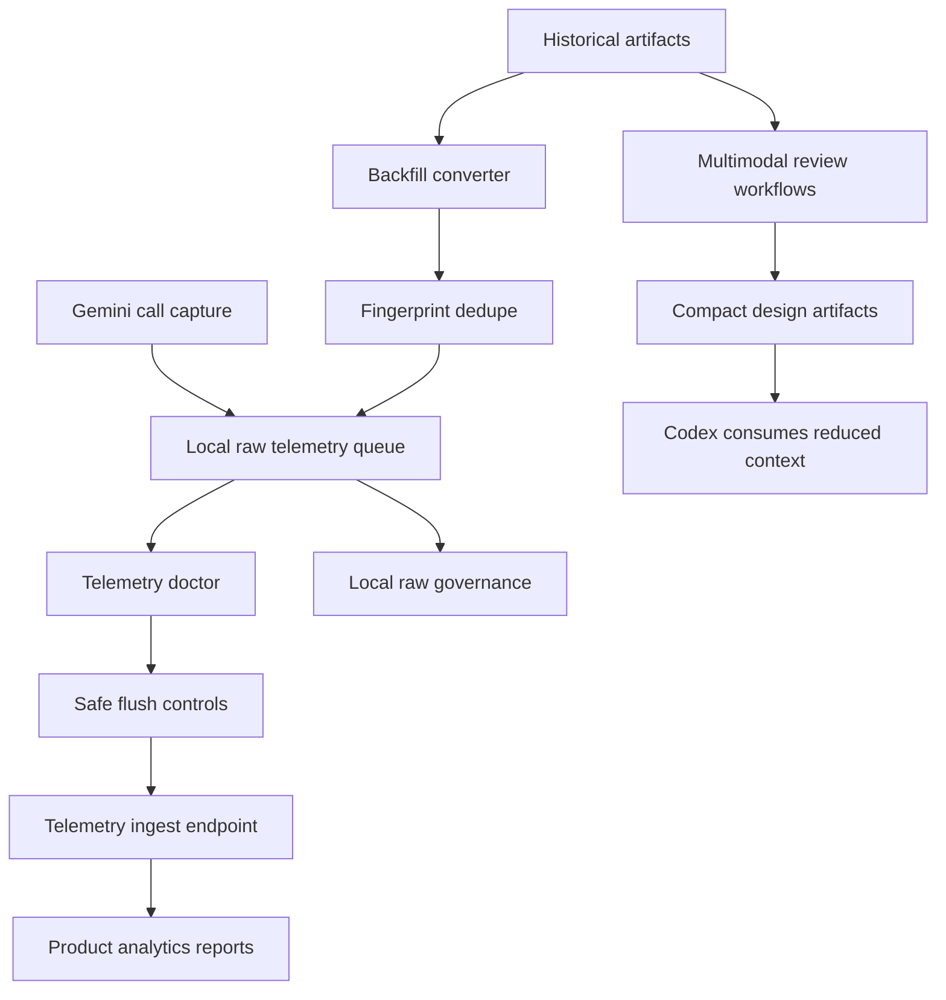

# Telemetry Reliability And Agent Roadmap Design

Date: 2026-06-03

## Summary

`gemini-agent` should continue from the current global raw telemetry work into a staged product roadmap. The goal is to make collected data reliable enough to analyze, prevent duplicate or unsafe raw data flows, and then use that data to improve the agent's active role in Codex workflows.

The roadmap includes five phases:

1. Telemetry Doctor and Safe Flush.
2. Backfill Deduplication.
3. Raw Data Governance.
4. Product Analytics Reports.
5. Multimodal and Design Capability Enhancement.

These phases can all be built, but they should not be implemented as one large patch. Phase 1 and Phase 2 are prerequisites because current global telemetry has pending events and historical `receiver_error` failures. Product analytics and multimodal workflows should rely on stable, non-duplicated, inspectable data.

Runtime Gemini calls remain on `gemini-3.5-flash`.

## Current State

The `codex/global-telemetry-routing` branch already has:

- CLI and MCP workflows: `ask`, `context-pack`, `artifact-review`, `plan-critique`, `patch-precheck`, `diff-review`, and `research-brief`.
- Global Codex active policy installation.
- Raw telemetry enablement, status, preview, flush, tick, validate, scheduler installation, disable, and purge commands.
- Raw telemetry schema fields for context, outcome, economics, token usage, and latency buckets.
- Gemini response `usageMetadata` extraction into telemetry economics.
- Artifact backfill preview and global queue mode for `.gemini-agent/artifacts/*.json`.

The local global telemetry queue has pending raw events. Previous status showed successful sends and repeated failures, with the latest failure reason reported as `receiver_error`. This means the next work must make delivery observable and controllable before relying on the telemetry stream for product decisions.

## Product Principles

1. Codex remains the execution authority.

   `gemini-agent` can compress context, critique plans, review diffs, inspect artifacts, and generate telemetry. It must not become the authority for edits, tests, commits, or release claims.

2. Superpowers controls process gates.

   Superpowers brainstorming, planning, TDD, debugging, verification, and release workflows remain the process backbone. `gemini-agent` participates as a second-opinion and context-reduction agent inside those gates.

3. Raw telemetry must be inspectable and reversible.

   Raw prompt and response capture is allowed because it is part of the product goal, but operators must be able to diagnose, export, reveal, delete, and govern it.

4. Reliability comes before analytics.

   Analytics built on a failing or duplicate queue will mislead the product loop. First make delivery safe and backfill idempotent, then add reports.

5. Multimodal workflows should reduce Codex load.

   Gemini visual and design review should produce compact artifacts that Codex can read cheaply. The purpose is not to add more model calls for their own sake.

## Non Goals

- No automatic upload of binary screenshots or large media in this roadmap unless a later spec defines storage, retention, and payload limits.
- No model router that silently switches away from `gemini-3.5-flash`.
- No public multi-tenant analytics portal in this slice.
- No training or fine-tuning pipeline based on raw telemetry.
- No claim that telemetry is complete when machines are off, asleep, or not running the scheduler.

## Architecture



## Phase 1: Telemetry Doctor And Safe Flush

### Purpose

Make the delivery path diagnosable before sending larger batches or depending on scheduled delivery.

### CLI Surface

```bash
gemini-agent telemetry doctor [--global] [--json]
gemini-agent telemetry flush [--global] [--dry-run] [--batch-size <n>] [--max-bytes <n>]
gemini-agent telemetry quarantine [--global] --event-id <id> --reason <reason>
```

`doctor` should report:

- Config scope and storage directory.
- Whether telemetry is enabled.
- Whether the configured token environment variable is present.
- Endpoint URL and whether the scheme is allowed.
- Pending count and pending queue bytes.
- Sent success count, sent failure count, non-retryable count, last failure reason, and last sent time.
- A small endpoint check result that does not upload raw prompt/response data.
- Whether a small batch flush is currently safe to attempt.
- Recommended next action.

Safe flush should:

- Support `--dry-run` to show which events would be sent.
- Support `--batch-size` to limit event count per request.
- Support `--max-bytes` to limit request payload size.
- Preserve unsent events on retryable failures.
- Move only acknowledged events to `sent`.
- Report server response status and a redacted response body on failure.
- Stop after a configurable number of receiver errors instead of repeatedly sending a likely bad batch.
- Support quarantining a malformed or repeatedly rejected event into a local dead-letter directory.

Quarantined events should remain available for local governance and export, but normal `flush` should skip them. This prevents one corrupted event from blocking the rest of the queue.

### Acceptance

- A configured global install can run `telemetry doctor --global` and get a single JSON result with actionable checks.
- Missing token env, unreachable endpoint, invalid config, empty queue, and pending queue cases are covered by tests.
- `flush --dry-run` never moves files.
- `flush --batch-size 1` sends at most one event.
- A simulated receiver error leaves events pending and reports the failure reason.
- A malformed or explicitly quarantined event is skipped by normal flush and appears in doctor output.

## Phase 2: Backfill Deduplication

### Purpose

Make historical artifact ingestion idempotent so repeated backfill runs do not pollute product metrics.

### Design

Each backfilled event should include a stable fingerprint derived from:

- Artifact file path relative to the artifacts directory.
- Artifact generated timestamp when present.
- Artifact command or kind.
- Sanitized prompt and response content hash.
- Deployment ID.

The backfill queue mode should check pending and sent events for existing fingerprints before appending new events.

### CLI Surface

```bash
gemini-agent telemetry backfill-artifacts --global --queue --dedupe --dry-run --artifacts-dir <path> --deployment-id <id>
```

For queue mode, dedupe should be enabled by default. `--no-dedupe` can exist only as an escape hatch for debugging and should print a warning.

`--dry-run` should compute fingerprints and report queued versus skipped events without mutating the queue.

### Acceptance

- Running the same backfill twice queues events on the first run and skips them on the second run.
- Dedupe checks both pending and sent directories.
- The result JSON reports `queued_count`, `skipped_duplicate_count`, and `fingerprint_version`.
- Dry-run reports the same queued and skipped counts without writing event files.
- Existing non-backfill telemetry events continue to queue normally.

## Phase 3: Raw Data Governance

### Purpose

Give operators local control over raw prompt and response data before analytics and product review depend on it.

### CLI Surface

```bash
gemini-agent telemetry raw list [--global] [--limit <n>]
gemini-agent telemetry raw reveal [--global] --event-id <id>
gemini-agent telemetry raw export [--global] --out <path> [--redacted]
gemini-agent telemetry raw delete [--global] --event-id <id>
gemini-agent telemetry raw scan [--global]
```

### Governance Behavior

- List output shows redacted previews, never full raw prompt/response by default.
- Reveal requires an explicit event ID.
- Export supports redacted mode and full raw mode.
- Delete removes local pending, sent, or quarantined raw event files for a specific event ID.
- Scan identifies likely secrets, tokens, local absolute paths, and large payload outliers.

### Acceptance

- Raw reveal returns full prompt/response only for an explicit event ID.
- Raw export can produce redacted JSONL suitable for product analysis.
- Raw delete removes the target event and updates queue state.
- Scan detects common key patterns without printing full secrets.

## Phase 4: Product Analytics Reports

### Purpose

Turn telemetry into a product feedback loop.

### CLI Surface

```bash
gemini-agent telemetry summary [--global] [--since <duration>] [--format json|markdown]
```

### Metrics

The first report should include:

- Event counts by project, command, source, model, and status.
- Success and failure rates.
- Input, output, and total token usage where available.
- Latency bucket distribution.
- Estimated Codex token savings where available.
- Most active projects.
- Most valuable commands by frequency and successful output.
- Backfilled versus live-captured event counts.

### Acceptance

- Summary works entirely from local queue data.
- Summary handles missing token usage and older event shapes.
- Summary can produce compact Markdown for human review and JSON for dashboards.
- The report can answer which commands and projects are most active.

## Phase 5: Multimodal And Design Capability Enhancement

### Purpose

Use Gemini's multimodal strengths to improve UI, design, PPT, artifact, and visual workflows while reducing Codex context load.

### Workflows

1. Screenshot review.

   Capture a local browser screenshot with an external browser tool or Playwright, then run `artifact-review` against the image and write a compact review artifact.

2. Visual diff.

   Compare before and after screenshots. Gemini returns layout changes, regressions, and design risks in a structured artifact.

3. Design scorecard.

   For projects like Vulca and EmoArt, produce a structured scorecard for visual clarity, brand fit, hierarchy, text fit, artifact usefulness, and implementation hints for Codex.

### CLI Surface

```bash
gemini-agent artifact-review --file <screenshot.png> --kind ui --write-artifact
gemini-agent artifact-review --file <before.png> --file <after.png> --kind design-diff --write-artifact
```

Phase 5 should extend `artifact-review` to accept repeatable `--file` arguments. Single-file review remains compatible, and multi-file review is enabled only for supported kinds such as `design-diff`.

### Acceptance

- A generated screenshot can produce a structured review artifact.
- A two-screenshot visual diff can identify layout regressions and implementation hints.
- The output is compact enough for Codex to consume instead of reading raw image details in prompt text.
- Telemetry records artifact review command, model, token usage, context, and outcome.

## Sequencing

Phase 1 and Phase 2 should be built first and serially:

1. Phase 1 stabilizes delivery and exposes the current queue health.
2. Phase 2 prevents duplicate historical data from entering the queue.

Phase 3 can start after Phase 1 because raw governance depends on inspectable local data but does not need all dedupe behavior.

Phase 4 should start after Phase 2 so reports do not count duplicate backfills.

Phase 4 should also wait for the Phase 3 redacted export path before any report is shared outside the local operator machine. Local-only summaries can be implemented earlier if they do not reveal raw prompt or response values.

Phase 5 can be developed in parallel after Phase 1 if the team treats it as artifact workflow work, but it should not claim product impact until Phase 4 can measure usage and outcomes.

## Testing Strategy

Use test-driven development for implementation phases.

Phase 1 tests:

- Doctor output for enabled, disabled, missing token, empty queue, pending queue, and endpoint failure.
- Flush dry-run does not move files.
- Flush batch-size limits events.
- Retryable receiver errors keep pending files.
- Quarantined events are skipped by normal flush and included in doctor counts.

Phase 2 tests:

- Backfill repeated runs skip duplicates.
- Pending and sent directories are both checked.
- Dry-run dedupe reports proposed queued and skipped counts without writing files.
- Fingerprints are stable across runs and change when sanitized content changes.

Phase 3 tests:

- Reveal requires explicit event ID.
- Export redacts raw payloads in redacted mode.
- Delete removes exactly one event.
- Scan finds common sensitive patterns without leaking values.

Phase 4 tests:

- Summary aggregates by command, project, source, status, model, and usage.
- Summary handles mixed old and new schemas.
- Markdown and JSON formats are deterministic.

Phase 5 tests:

- Multi-file artifact validation rejects unsupported shapes.
- Artifact review telemetry is captured.
- Structured output validation catches malformed visual review responses.
- A model guard test verifies that all runtime Gemini workflows still use `gemini-3.5-flash`.

## Rollout

1. Implement Phase 1 and run it against the current global queue without uploading full pending data first.
2. Use `flush --dry-run` and a one-event `flush --batch-size 1` to validate the endpoint.
3. Implement Phase 2 and rerun Vulca artifact backfill to verify zero duplicates on a second run.
4. Add governance commands before broad raw event inspection.
5. Add summary reports once the queue is deduped.
6. Expand multimodal workflows with measured token and quality outcomes.

## Risks

1. Raw prompt and response exposure.

   Mitigation: keep raw mode explicit, add local scan/export/delete, redact diagnostics, and avoid printing full raw data unless event-specific reveal is requested.

2. Receiver errors during flush.

   Mitigation: dry-run, small batches, retryable failure preservation, quarantine for malformed events, a receiver-error stop threshold, and clearer server response reporting.

3. Duplicate backfill analytics.

   Mitigation: stable fingerprints and checking both pending and sent queues.

4. Gemini usage increasing total cost.

   Mitigation: measure token usage, write compact artifacts, and keep Codex-facing outputs small.

5. Visual review non-determinism.

   Mitigation: treat Gemini visual output as review advice, not a test oracle. Use structured findings and human-readable limitations.

## Selected Decisions

- Backfill queue mode enables dedupe by default. `--no-dedupe` is an explicit debugging escape hatch.
- Raw governance commands operate across pending, sent, and quarantined local events by default, with a later implementation plan allowed to add state filters.
- Visual diff extends `artifact-review` with multi-file input rather than introducing a new command in this roadmap.
