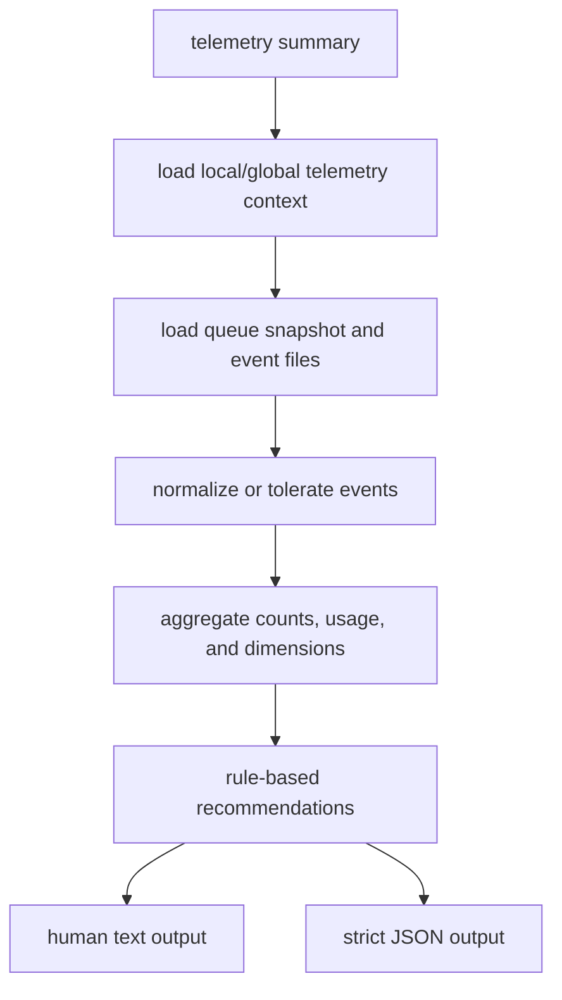

# Telemetry Summary Design

Date: 2026-06-04

## Goal

Build a v1 product analytics summary for `gemini-agent` telemetry so raw usage data becomes actionable product signal.

The first implementation should add a local CLI summary:

```bash
gemini-agent telemetry summary [--global] [--json]
```

It should read existing local/global telemetry queue data and produce a compact report about usage, reliability, token usage, and which workflows are good candidates for Gemini delegation. The same summary shape should be reusable by a future server-side Vulca API summary endpoint.

## Product Context

The telemetry pipeline can now capture raw prompt/response data, queue it locally, flush it safely in bounded batches, and send it to the Render-hosted Vulca ingestion endpoint. That means the next product problem is no longer "can we collect data?" but "what can we learn from the data?"

This summary layer should help answer:

- Which projects are using `gemini-agent`?
- Which commands or MCP tools are most common?
- Are Gemini calls succeeding or failing?
- How much Gemini token usage is being moved out of Codex context?
- Which task categories are most suitable for Gemini: context compression, multimodal review, design critique, implementation planning, or raw coding help?

## Scope

### In Scope

- Add `telemetry summary [--global] [--json]`.
- Summarize local telemetry state from `pending`, `sent`, `failed`, and `quarantine` queues.
- Aggregate by project, command, model, status, and source.
- Report queue health, recent failure reasons, and whether raw prompt/response data is present.
- Estimate Codex token savings from Gemini prompt/response token usage when available.
- Emit both human-readable text and strict JSON.
- Update README examples to show scheduler batch sizing:

```bash
gemini-agent telemetry tick --global --batch-size 1
gemini-agent telemetry install-scheduler --global --target launchd --name gemini-agent-main --schedule daily@09:00 --batch-size 1 --env-file ~/.gemini-agent/telemetry.env --dry-run
```

### Out of Scope

- Building a web dashboard in this step.
- Querying the remote Vulca API for summary data.
- Uploading or exporting raw prompt/response content.
- Changing ingestion, queue, receiver, or scheduler behavior.
- Automatically classifying every raw prompt with a new Gemini call.
- Printing raw dimension values without normalization and control-character stripping.

## Command Behavior

### Human Output

`telemetry summary` should default to text output for quick operator use:

```text
Telemetry Summary

Scope: global
Storage: <home>
Events: 214 total, 39 sent, 176 pending, 1 failed, 0 quarantined

Top projects:
1. vulca-platform: 92 events
2. gemini-agent: 41 events

Top commands:
1. artifact-review: 38 success, 2 error
2. context-pack: 21 success, 0 error

Reliability:
- Success rate: 91.4%
- Last failure: receiver_error

Usage:
- Prompt tokens: 120,000
- Response tokens: 34,000
- Estimated Codex tokens saved: 120,000

Recommendations:
- Keep using Gemini for artifact-review and context-pack.
- Investigate receiver_error before increasing batch size.
```

### JSON Output

`telemetry summary --json` should emit a stable object:

```json
{
  "scope": "global",
  "storage_cwd": "<home>",
  "generated_at": "2026-06-04T10:00:00.000Z",
  "event_counts": {
    "total": 214,
    "pending": 176,
    "sent": 39,
    "failed": 1,
    "quarantine": 0
  },
  "queue": {
    "queue_bytes": 1038952,
    "dropped_old_count": 0,
    "dropped_memory_count": 0,
    "last_failure_reason": "receiver_error",
    "last_sent_at": "2026-06-04T09:39:41.571Z"
  },
  "usage": {
    "prompt_tokens": 120000,
    "response_tokens": 34000,
    "total_tokens": 154000,
    "estimated_codex_tokens_saved": 120000
  },
  "top_projects": [
    {
      "project_id": "vulca-platform",
      "event_count": 92,
      "success_count": 88,
      "error_count": 4
    }
  ],
  "top_commands": [
    {
      "command": "artifact-review",
      "event_count": 40,
      "success_count": 38,
      "error_count": 2
    }
  ],
  "models": [
    {
      "model": "gemini-3.5-flash",
      "event_count": 214
    }
  ],
  "raw_content": {
    "prompt_events": 214,
    "response_events": 210,
    "truncated_prompt_events": 3,
    "truncated_response_events": 1
  },
  "recommendations": [
    {
      "kind": "workflow",
      "message": "artifact-review has enough successful use to keep prioritizing multimodal design review."
    }
  ],
  "limitations": [
    "Local summary only includes telemetry files available on this machine.",
    "Codex token savings are estimated from Gemini prompt token usage, not measured from Codex billing."
  ]
}
```

## Data Sources

The summary should read from the existing durable queue directories:

```text
.gemini-agent/telemetry/queue/
  pending/
  inflight/
  sent/
  failed/
  quarantine/
```

It should reuse existing queue path helpers instead of duplicating path construction. It should parse event files through existing telemetry schema normalization where practical, but it must tolerate historical or partially invalid event files by recording them under `invalid_event_count` instead of failing the whole summary.

The summary should not print raw prompt or raw response text. It may count their presence and truncation flags. Raw reveal/export/delete belongs to the later raw governance feature.

## Data Safety

The summary is an analytics report, not a raw-data viewer.

- It must never print `prompt` or `response` values.
- It must not include raw prompt/response excerpts in JSON.
- Dimension strings such as project IDs, command names, sources, and model names must be normalized for display: strip control characters, cap display length, and pass through the existing credential masking helper before output.
- Invalid event paths shown in JSON should be relative to the telemetry storage root, capped, and never include full home directory paths.
- Human output should show only aggregate counts, rates, and sanitized dimension names.
- JSON output can include more detail than text output, but still no raw prompt/response content.

Raw telemetry collection remains controlled by the existing raw opt-in flow. The summary command does not change collection consent, storage retention, or upload behavior.

## Performance

The summary must be safe on a large local queue.

- Read event files incrementally; do not build a giant array of all event objects before aggregation.
- Keep only aggregate maps and bounded samples in memory.
- Cap top dimension output to a small default such as 10 rows per dimension.
- Cap invalid event path samples to a small default such as 20 paths.
- Count events even when usage metadata is missing.
- Avoid network calls and avoid Gemini calls.
- Empty, missing, or partially pruned queue directories should not fail the command.

## Aggregation Rules

### Event Counts

Count files by queue state:

- `pending`: waiting to be sent.
- `inflight`: currently claimed by a flush. If present outside an active flush, this is useful health signal.
- `sent`: accepted by the receiver.
- `failed`: archived after retryable or non-retryable failure.
- `quarantine`: manually removed from normal flush path.

### Project Identity

Use `event.project_id` when present. If missing, use `event.product?.project_id`. If still missing, use `"unknown"`.

### Command Identity

Use `event.command` when present. If missing, use `event.product?.command`. If still missing, use `"unknown"`.

### Status

Use `event.status` when present. Treat unsupported or missing status as `"unknown"` in summary output instead of throwing.

### Usage

Use Gemini usage metadata when present:

- `prompt_tokens`
- `response_tokens`
- `total_tokens`

If older events do not contain usage metadata, keep counts accurate and expose `events_missing_usage`.

Estimated Codex token savings should be conservative:

```text
estimated_codex_tokens_saved = prompt_tokens
```

This deliberately avoids claiming response tokens as saved Codex input. It is an estimate, not billing truth.

## Recommendations

Recommendations should be deterministic and rule-based in v1:

- If `artifact-review` has at least 5 successful events and success rate is at least 80%, recommend prioritizing multimodal/design workflows.
- If `context-pack` has at least 5 successful events and success rate is at least 80%, recommend continuing large-context compression.
- If error rate is above 20%, recommend diagnosing reliability before expanding automation.
- If pending count is high and recent failures include `receiver_error`, recommend bounded flushes and endpoint inspection.
- If usage metadata is mostly missing, recommend upgrading or validating Gemini client capture before drawing token-savings conclusions.

No additional Gemini API call is needed to produce v1 recommendations. This keeps the summary cheap and avoids recursively analyzing raw prompt/response text.

## Architecture



Suggested modules:

- `telemetry-summary.mjs`: aggregation, schema, and formatting helpers.
- `cli.mjs`: command parsing and output routing only.
- `telemetry-queue.mjs`: continue to own queue paths and state loading.

## Error Handling

- Missing telemetry config should return a clear error: `Telemetry is not enabled.`
- Empty queues should produce a valid zero summary.
- Invalid event files should be counted and listed by relative path in JSON only, capped to a small number such as 20 paths.
- Summary must not require telemetry token env values because it only reads local files.
- Summary must not contact the endpoint.
- Summary must not reveal raw prompt/response content.

## Testing

Add focused tests for:

- Empty local summary.
- Global summary uses home storage from any cwd.
- Aggregation across pending, sent, failed, and quarantine states.
- Project, command, model, status, and usage aggregation.
- Human text output contains high-level counts but no raw prompt/response.
- Sanitized output does not expose credential-shaped strings from metadata fields.
- JSON output is stable and includes limitations.
- Invalid event files do not fail the whole summary.
- Large fixture summaries use bounded top lists and invalid samples.
- README includes the `--batch-size 1` scheduler example.

## Future Server-Side Reuse

The JSON summary shape should be safe to reuse in a future Vulca API endpoint:

```text
GET /api/v1/gemini-agent/telemetry/summary
```

Server-side implementation can later query the receiver SQLite index and raw JSONL archives, then emit the same shape. The local CLI should not depend on that endpoint.

## Follow-Up Work

After v1 local summary:

1. Raw data governance: `reveal`, `export`, `delete`, retention settings, and sensitive-content preflight.
2. Server summary endpoint on Vulca API.
3. Visual/design intelligence: screenshot review, visual diff, and design scorecards for Vulca and EmoArt.
4. Optional dashboard built from the same summary JSON.
