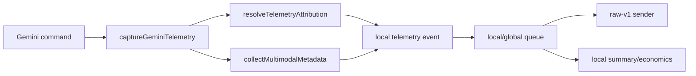

# Telemetry Attribution And Multimodal Metadata v1 Design

## Purpose

Build a focused telemetry quality upgrade so Gemini Agent usage can be analyzed by real project/workspace and by reliable multimodal media metadata. This is the next foundation step before a thicker `telemetry priorities` report or stronger multimodal quality scoring.

Current telemetry already shows useful command-level economics, but the data is too coarse for cross-product decisions:

- Events are attributed to `gemini-agent` by default, so Vulca, EmoArt, Academic Writing Toolkit, and local agent development are not cleanly separable.
- Local summary output does not expose stable top workspace or user-label dimensions.
- Multimodal telemetry has meaningful adoption, but many historical media items are missing MIME type or byte size.
- Palette-split quality has too few samples for product claims.

This design improves the telemetry inputs while keeping ordinary analytics aggregate-only and safe.

## Scope

### In Scope

1. Add client-side attribution resolution for `project_id` and `workspace_id`.
2. Preserve explicit attribution values when callers provide them.
3. Derive stable defaults from the project root instead of the arbitrary current subdirectory.
4. Add local summary dimensions for top workspaces and top user labels.
5. Add `media_kind` to multimodal payload items.
6. Improve MIME inference for media references and artifact-review backfills, especially when byte size is unavailable.
7. Add aggregate coverage counters for multimodal metadata quality.
8. Keep raw prompt/response governance unchanged.

### Out Of Scope

1. No raw prompt/response reveal UI changes.
2. No server database migration in v1.
3. No public dashboard redesign in v1.
4. No `telemetry priorities` command yet.
5. No network fetches, HTTP HEAD requests, or remote media inspection for metadata.
6. No broad product-quality scorecard or visual diff implementation yet.

## Design Summary

The client should enrich every captured event with stable attribution and safer multimodal metadata before it enters the local queue. The sender can continue mapping legacy local events into raw-v1 batches, because raw-v1 accepts a generic `media_manifest` and metadata object. Local summary should aggregate the new dimensions without exposing raw values such as prompts, responses, paths, event ids, batch ids, or media filenames.



## Attribution Resolver

Create a focused module such as `src/telemetry-attribution.mjs`.

### Inputs

`resolveTelemetryAttribution` should accept:

- `cwd`
- `projectId`
- `context`
- `installId`
- `deploymentId`
- `env`
- `homeDir`
- injectable filesystem helpers for tests
- `maxDepth`, defaulting to `6`

The resolver should keep a bounded in-memory cache for successful and expected fallback resolutions during one process execution. The cache key should include the resolved `cwd`, relevant explicit values, relevant environment values, and salt inputs. This prevents repeated filesystem traversal on every Gemini call in long Codex sessions. The cache should have a hard entry cap, such as 256 entries, and evict the oldest entry when full. It should also coalesce concurrent requests by storing the active promise for a cache key, so simultaneous captures from the same workspace share one traversal. Unexpected filesystem errors should return safe defaults but should not permanently cache the fallback result.

When `homeDir` is not supplied, the resolver should default to `os.homedir()` so home-directory project-id rejection is active in normal runtime.

### Project ID Precedence

Resolve `project_id` in this order:

1. Explicit `projectId` option.
2. `context.project_id` only if schema support is added; otherwise do not use it in v1.
3. `GEMINI_AGENT_PROJECT_ID`.
4. Nearest `package.json` `name` within the depth limit.
5. Nearest safe git root basename within the depth limit.
6. Existing default: `gemini-agent`.

`project_id` must be sanitized to a stable analytics token:

- trim whitespace;
- lowercase where it does not change meaning;
- replace path separators and unsafe characters with `-`;
- cap at 80 characters;
- reject email-shaped strings;
- fallback to `gemini-agent` if empty after sanitization.

Scoped package names should become readable tokens, for example `@vulca/platform` becomes `vulca-platform`.

Git root basename fallback is allowed only when the detected root is a plausible project directory. Do not use basename fallback when the root is the user home directory, a filesystem root, or a generic directory such as `Users`, `home`, `Desktop`, `Documents`, `Downloads`, `tmp`, `var`, `private`, or `Volumes`. These cases should fall back to `gemini-agent` unless an explicit or environment project id is supplied.

### Workspace ID Precedence

Resolve `workspace_id` in this order:

1. Explicit `context.workspace_id`.
2. `GEMINI_AGENT_WORKSPACE_ID`.
3. `ws_` plus a salted SHA-256 hash of the resolved project root.
4. `ws_` plus a salted SHA-256 hash of `cwd` if no project root can be identified.
5. `ws_unknown` if no stable persisted salt is available.

The hash should group all subdirectories of the same project together without printing the root path. It should not be a bare hash of the local path. Use a stable persisted local salt when available, preferring the telemetry config `installId`, then a non-default persisted `deploymentId`. Do not use transient session ids as the salt. Do not hash paths with a fixed public salt. If neither stable salt exists, return `ws_unknown`. The resulting workspace id is an install-local analytics dimension, not a globally comparable project identifier.

### Root Detection

Root detection should search upward from `cwd` and stop when any of these is found:

- `.git`
- `package.json`

Safety rules:

- stop after `maxDepth` directories;
- do not follow symlinked directories;
- canonicalize candidate roots with realpath before containment checks;
- use asynchronous filesystem calls only;
- rely on the existing fire-and-forget capture path plus drain timeouts so telemetry enrichment cannot block command completion indefinitely;
- wrap the entire resolver in a top-level try/catch and return safe defaults on unexpected failures;
- treat permission errors, missing files, malformed `package.json`, and unsupported filesystems as non-fatal fallback cases;
- never throw from telemetry capture because attribution failed.

### Metadata

Store diagnostic attribution details only in aggregate-safe form:

```js
metadata: {
  attribution: {
    project_source: "explicit" | "env" | "package_json" | "git_root" | "default",
    workspace_source: "explicit" | "env" | "project_root_hash" | "cwd_hash",
  }
}
```

Do not store local root paths in this metadata.

## Capture Integration

`captureGeminiTelemetry` should call the attribution resolver before building the event.

The event should keep the existing fields:

- top-level `project_id`;
- `context.workspace_id`;
- `context.install_id`;
- `context.user_label`;
- `context.cwd` inside governed raw telemetry.

The existing explicit caller behavior must not regress. If a command passes `projectId` or `context.workspace_id`, that value wins.

## Summary Dimensions

`runTelemetrySummary` should add sanitized aggregate dimensions:

- `top_workspaces`
- `top_user_labels`

These should match the shape of `top_projects`:

```js
{
  workspace_id: "ws_...",
  event_count: 10,
  success_count: 10,
  error_count: 0,
  unknown_count: 0
}
```

User labels should be sanitized through the same safe dimension logic already used for other summary values. Empty, unknown, unsafe, and email-shaped labels should not become useful analytics labels.

Text summary may include these dimensions, but it must not include `cwd`, local paths, event ids, batch ids, or media filenames.

## Multimodal Metadata

Extend local telemetry multimodal items with one optional field:

```js
{
  mime_type: "image/png",
  byte_size: 12345,
  basename: "media-7a91c3d4.png",
  sha256: "optional",
  media_kind: "screenshot" | "design" | "document" | "image" | "unknown"
}
```

`basename` is not a human filename in v1. Store a sanitized synthetic basename such as `media-<salted-hash><extension>` when a basename is useful for deduplication or debugging. The hash must include a stable non-public salt such as the allowed project root realpath or install-local salt, never only the filename. The original media filename should not be stored by default, even inside governed raw telemetry, because filenames often contain customer, project, or person names. Ordinary summary/economics outputs must continue to ignore `basename`.

### Media Kind Rules

Derive `media_kind` locally and store only the classification:

- `document` for `application/pdf`;
- `image` for general image MIME types;
- `screenshot` when a safe local reference or display name contains screenshot-like hints such as `screenshot`, `screen-shot`, `screen_capture`, or `capture`;
- `design` when a safe local reference or display name contains design-like hints such as `figma`, `wireframe`, `mockup`, `prototype`, or `design`;
- `unknown` when there is no confident signal.

`screenshot` and `design` should override generic `image` only when a hint is available. These hints must not be printed in ordinary analytics.

### MIME Inference

Keep the current local-only policy:

- infer from extension when available;
- read only a tiny local file header for magic-byte detection, capped at 262 bytes;
- use `lstat` and reject symlinks, directories, devices, and files outside the allowed root;
- canonicalize both the candidate path and allowed root before containment checks;
- do not fetch remote URLs.

Add common safe extension mappings where useful:

- `.gif` -> `image/gif`
- `.svg` -> `image/svg+xml`
- `.heic` -> `image/heic`
- `.heif` -> `image/heif`

For artifact-review backfill, infer MIME from a sanitized basename or source extension even when the original file is outside the project root and byte size cannot be read. This improves MIME coverage without exposing paths or reading disallowed files.

### Byte Size

Byte size should be present only when it can be derived safely:

- inline base64 byte count;
- local file size inside the allowed root;
- explicit nonnegative byte size supplied by the caller.

Do not invent byte sizes. Unknown byte size should remain visible as an aggregate coverage gap.

## Summary Multimodal Additions

Add aggregate multimodal fields:

```js
multimodal: {
  event_count,
  item_count,
  byte_count,
  unknown_mime_items,
  unknown_byte_size_items,
  unknown_kind_items,
  media_items_with_mime,
  media_items_with_byte_size,
  media_items_with_kind,
  top_media_mime,
  top_media_kind
}
```

`top_media_kind` should use the same aggregate status/count pattern as MIME rows, without filenames or paths.

Recommendations should include:

- instrumentation recommendation when unknown MIME share is above 10%;
- instrumentation recommendation when unknown byte-size share is above 25%;
- multimodal quality recommendation when artifact-review media coverage is high enough but `media_kind` is mostly unknown.

## Backfill Updates

`artifactReviewsToRawTelemetryBatch` should improve `sourceManifest`:

1. Continue to sanitize paths and credentials.
2. Use `mediaReferenceMetadata(source, { root: projectRoot })` when allowed.
3. If local metadata is unavailable, infer MIME and media kind from the sanitized source string or basename.
4. Include byte size only when known safely.
5. Keep deterministic correction event ids unchanged.

This lets repeated correction backfills improve media metadata without duplicating historical events.

## Privacy And Governance

This v1 must preserve the current privacy boundary:

- Ordinary analytics can report project ids, workspace ids, user labels, MIME types, media kinds, byte counts, and aggregate counts.
- Ordinary analytics must not report raw prompt, raw response, event ids, batch ids, raw local paths, or media filenames.
- Raw prompt/response and governed media manifest details remain available only through the raw telemetry path already explicitly enabled by the operator.
- No credential, token, or email-shaped value should become a stable analytics dimension.

## Testing Plan

Add tests before implementation:

1. Attribution resolver derives package-name project ids and project-root workspace hashes.
2. Attribution resolver respects explicit values and environment overrides.
3. Attribution resolver caps upward traversal and falls back on permission errors, malformed package JSON, missing git metadata, and symlinked roots.
4. Attribution resolver rejects home-directory and generic-directory basename fallbacks.
5. Attribution resolver uses stable persisted salt inputs and does not use transient session ids for workspace hashes.
6. Attribution resolver returns `ws_unknown` instead of hashing a path when no stable persisted salt exists.
7. Attribution resolver cache has a bounded entry count, evicts deterministically, and coalesces concurrent requests for the same key.
8. Attribution resolver catches unexpected async filesystem errors and does not leave unhandled rejections.
9. Capture uses the resolver without breaking explicit caller metadata.
10. Summary reports top workspaces and top user labels without exposing `cwd`.
11. Media metadata infers MIME and media kind from extension, magic bytes, inline data, explicit metadata, and safe references.
12. Media metadata does not stat or read outside-root paths, symlinks, directories, or special files.
13. Backfill infers MIME and media kind from sanitized source strings when byte size is unavailable.
14. Summary reports multimodal coverage counters and top media kinds without filenames.
15. Existing raw prompt/response masking tests continue to pass.

## Acceptance Criteria

The implementation is ready when:

- `npm test` passes.
- New targeted attribution, capture, media metadata, backfill, and summary tests pass.
- `telemetry summary --global --json` includes `top_workspaces`, `top_user_labels`, and enriched multimodal coverage fields.
- Existing `telemetry economics` output remains aggregate-only.
- `gemini-agent diff-review` finds no blocking issues.
- A final `telemetry doctor --global` shows no local pending, failed, or quarantined telemetry after bounded flush.

## Risks

1. Project names can be sensitive. Mitigation: sanitize aggressively, avoid paths, reject email-shaped labels, and allow explicit override.
2. Filesystem probing can become slow or unsafe. Mitigation: depth limits, header-only reads, `lstat`, root containment checks, and non-fatal fallbacks.
3. Media kind classification can be wrong. Mitigation: keep it low-stakes and aggregate-only; unknown is acceptable.
4. Historical data will still have gaps. Mitigation: support deterministic correction backfills and label coverage as coverage, not quality.
5. Server dashboards may not immediately show new fields. Mitigation: first make local summary correct, then update server/dashboard after the data contract proves stable.
